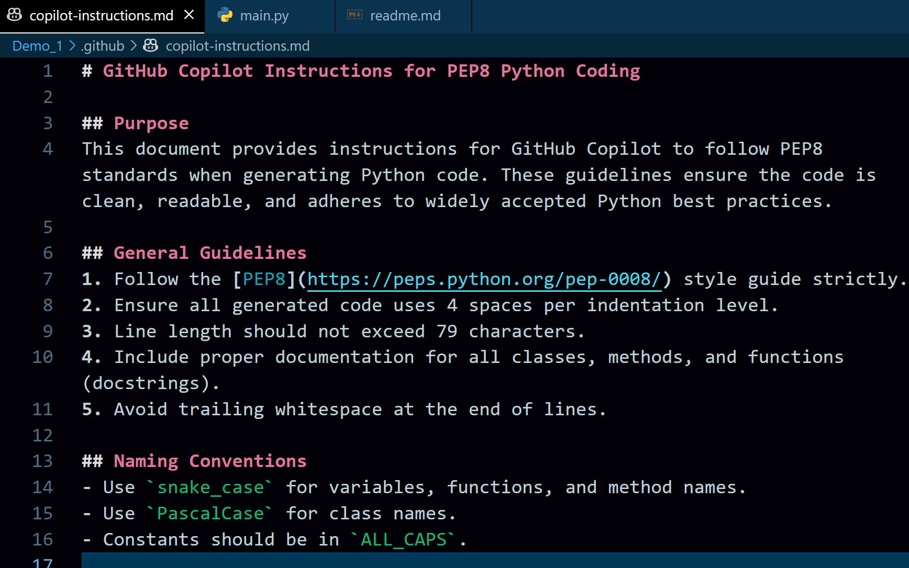
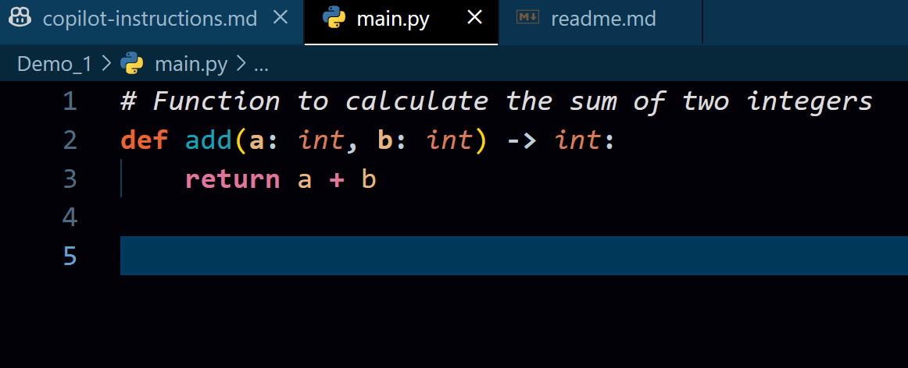
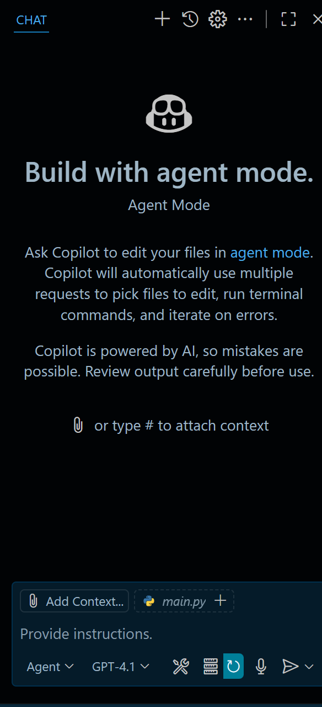
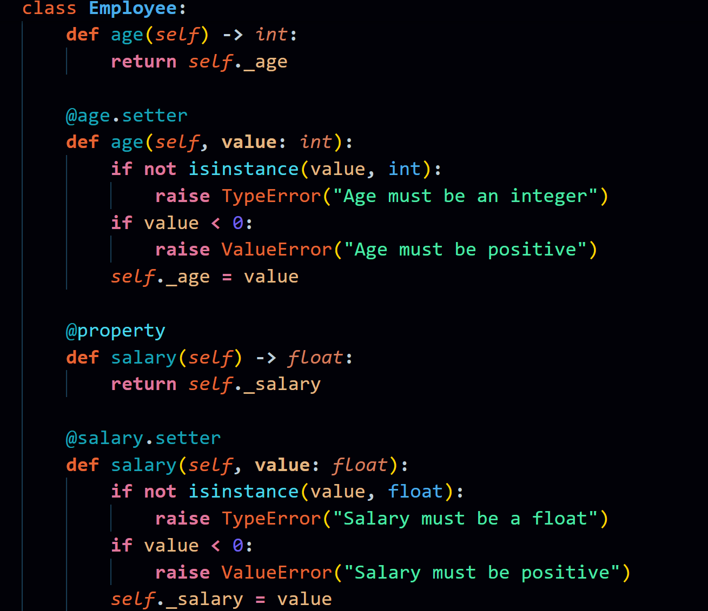
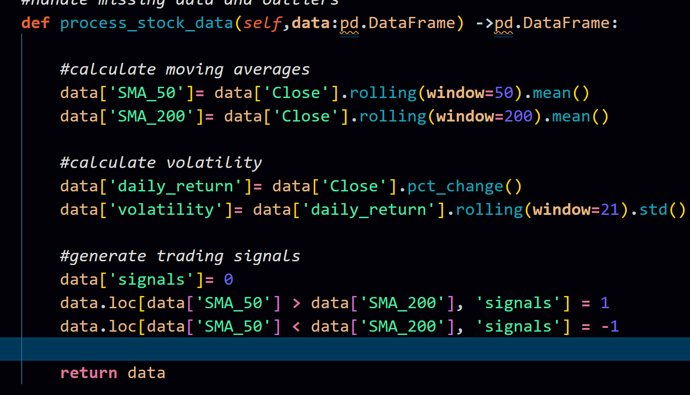

# GitAICampusVerse_content


use the [.github/copilot-instructions.md](https://github.com/mitul3737/GitAICampusVerse_content/blob/main/.github/copilot-instructions.md) file



Then create a folder called main.py and  comment there.

`Function to  calculate the sum of  two integers`

Co-pilot will then generate the code



## Completion Panel
We can also use "Completion Panel"

Press the co-pilot icon in the right corner and you will see this....


Once a comment is added or co-pilot is asked to generate a code, you can press Open Completions Panel


## For models, we can choose the models of our choice.




## Comment-driven coding

```python
#  create an Employee class with name, age and salary attributes 

#Include type hints and validation for each field 

#  create an Employee class with name, age and salary attributes 

#Include type hints and validation for each field 
class Employee:
    def __init__(self, name: str, age: int, salary: float):
        self.name = name
        self.age = age
        self.salary = salary

    @property
    def name(self) -> str:
        return self._name
    
    @name.setter
    def name(self, value: str):
        if not isinstance(value, str):
            raise TypeError("Name must be a string")
        self._name = value


```

Copilot will generate something like this now



Then add this comment

`# Create an employee instance and print the name, age and salary`

Let's add one more method   for  processing stock data


Copy and paste this part in the file
```python
#create a function that processes stock market data
#calculate moving averages, volatility and trading signals
#handle missing data and outliers
def process_stock_data(self,data:pd.DataFrame) ->pd.DataFrame:
    #calculate moving averages
    data['SMA_50']= data['Close'].rolling(window=50).mean()
    data['SMA_200']= data['Close'].rolling(window=200).mean()

    #calculate volatility
    data['daily_return']= data['Close'].pct_change()
    data['volatility']= data['daily_return'].rolling(window=21).std()

```
Copilot  will generate these lines then



Let's test the main.py file now using [test_main.py]([https://github.com/mitul3737/GitAICampusVerse_content/blob/main/test_main.py)


